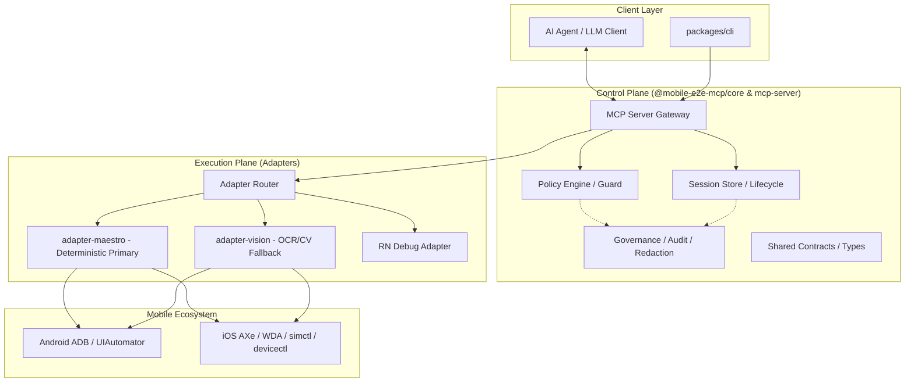

# System Architecture

## 1. Overview

mobile-e2e-mcp is a **mobile orchestration layer for AI agents**, not a single-framework test runner. It provides:

1. Multi-platform execution (iOS + Android) across simulators/emulators and real devices
2. Framework coverage for native, React Native, and Flutter apps
3. Deterministic-first automation with OCR/CV as bounded fallback
4. Session-oriented execution with audit trails and policy governance

### Non-Goals

- Replacing Appium/Detox/Maestro internals
- Building a custom device farm from scratch
- OCR-first automation for all actions
- A single abstraction that hides all platform differences
- Full parity for all native/RN/Flutter/system-UI flows in initial release

### Design Principles

1. **Deterministic-first:** Prefer accessibility tree and native automation APIs.
2. **Adapter-based:** Separate control plane from platform/framework adapters.
3. **Session-oriented:** Every action occurs inside a reproducible, auditable session.
4. **Evidence-rich:** Every failure returns screenshot, tree snapshot, logs, and action timeline.
5. **Progressive fallback:** Tree → semantic matching → OCR → CV template → human escalation.
6. **Governed automation:** Fine-grained permissions and action policy by environment.
7. **AUT contract first:** Determinism requires app-side testability contracts.

---

## 2. High-Level Architecture



---

## 3. Control Plane vs Execution Plane

### Control Plane

- MCP tool registration and schema contracts
- AuthZ/AuthN and policy checks
- Session lifecycle and run orchestration
- Audit, telemetry, and artifact indexing

### Execution Plane

- Platform-specific action execution
- Element resolution and retries
- Interruption detection and handling
- Screenshot/OCR/CV fallback orchestration
- Device and app-level diagnostics collection

### Dependency Direction

```
contracts -> core -> adapters -> mcp-server -> CLI
```

---

## 4. AUT Contract for Deterministic Automation

Each app under test must satisfy a minimum contract:

1. Stable IDs/identifiers for critical interactive elements
2. Accessibility semantics for key controls and states
3. Deterministic entry points (deep links/test hooks) for critical flows
4. Reset semantics (session/data/environment) documented
5. Loading and ready-state conventions defined

Without this contract, deterministic guarantees are downgraded and OCR/CV usage rises.

---

## 5. Session Model

Session payload includes:

- `sessionId` — unique execution identifier
- `platform` — android/ios
- `deviceId` — device UDID or serial
- `appId` — application identifier
- `policyProfile` — read-only / interactive / full-control
- `startedAt` / `endedAt` — timestamps
- `artifactsRoot` — artifact storage path
- `timeline` — ordered action/event log

### Tool Contract Standards

All MCP tools return structured envelopes:

| Field | Type | Description |
|---|---|---|
| `status` | enum | success \| failed \| partial |
| `reasonCode` | enum | Deterministic failure reason |
| `sessionId` | string | Active session identifier |
| `durationMs` | number | Execution duration |
| `attempts` | number | Retry count |
| `artifacts` | array | References to screenshots, logs, trees |
| `data` | object | Action-specific payload |
| `nextSuggestions` | array | Actionable hints for next step |

Do not return raw strings only. Return structured, machine-consumable envelopes.

---

## 6. Adapter Router

The adapter router selects the execution backend based on:

1. Platform (Android/iOS)
2. Target environment (emulator/simulator/real device)
3. Framework context (native/RN/Flutter)
4. Required capability (tree, logs, performance, action)
5. Policy constraints

Router output: selected adapter, confidence, fallback chain.

For detailed adapter design, see [02-platform-adapters.md](./02-platform-adapters.md).

---

## 7. Reliability Controls

- UI stability wait (layout hash unchanged threshold)
- Bounded retries with reason-aware backoff
- Overlay detection before action
- System alert / action sheet / permission prompt detection
- Keyboard state normalization
- Deterministic timeouts by action class
- Post-action verification hooks

### Execution State Machine

Required ordered state transitions:

1. Resolve stable locator (deterministic).
2. Execute platform-native action.
3. Detect interruption window before post-condition check.
4. If interruption is present, resolve via interruption policy.
5. Verify post-condition.
6. If resolution/action fails, evaluate fallback eligibility:
   - allow app test hook path (if available)
   - allow OCR/CV only under bounded policy
7. If bounded fallback fails, hard fail with reasonCode + artifacts.

Prohibited transitions:

- OCR/CV as first action path for standard controls
- Unbounded retry loops without state change evidence
- Silent downgrade from deterministic to probabilistic without telemetry

---

## 8. Visual Fallback Architecture

Primary: accessibility tree.

Fallback path:
1. Capture screenshot
2. Preprocess (contrast/invert/denoise)
3. OCR detect text regions
4. Map target intent to region
5. Inject coordinate action
6. Validate via post-action tree/screen change

CV template fallback reserved for icon-only UIs.

---

## 9. Related Documents

- [Platform Adapters & Framework Profiles](./02-platform-adapters.md) — Android/iOS backends, framework profiles
- [AI-First Capability Model](./03-capability-model.md) — capability layers, maturity model
- [Runtime Architecture](./04-runtime-architecture.md) — execution coordinator, fallback ladder, recovery
- [Governance & Security](./05-governance-security.md) — policy, audit, human handoff
