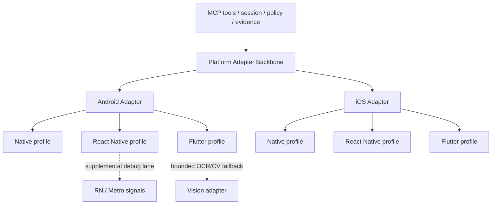

# Platform Adapters and Framework Profiles

> This document defines the platform adapter backbone and framework instrumentation profiles.
> For code placement rules, see [adapter-code-placement.md](./adapter-code-placement.md).

## 1. Platform Adapter Backbone

The project uses a **platform-backbone + framework-profile** model. Platform adapters are the execution backbone (Android/iOS). Framework profiles (Native/RN/Flutter) are instrumentation quality layers on top, not separate execution backends.



---

## 2. Android Adapter

### Backends

- **ADB**: Primary communication layer. Device/app lifecycle, shell actions, logs, screenshots.
- **UIAutomator2**: Deterministic UI tree and interactions via `uiautomator dump`.

### Command Mapping

| Action | Command |
|---|---|
| list devices | `adb devices` |
| launch app | `adb shell monkey -p <package> -c android.intent.category.LAUNCHER 1` |
| stop app | `adb shell am force-stop <package>` |
| tap | `adb shell input tap <x> <y>` |
| type text | `adb shell input text '<escaped>'` |
| swipe | `adb shell input swipe <x1> <y1> <x2> <y2> <duration>` |
| screenshot | `adb exec-out screencap -p` |
| hierarchy | `adb shell uiautomator dump /sdcard/ui.xml && adb shell cat /sdcard/ui.xml` |
| logs | `adb logcat` |
| back | `adb shell input keyevent 4` |
| home | `adb shell input keyevent 3` |

### Risks and Mitigations

- OEM fragmentation → compatibility matrix by API level and vendor
- Soft keyboard overlap → keyboard-state checks and normalized input paths
- Animation flakiness → animation disable profile in test env
- Permission dialogs variability → reusable permission-handler subflows

---

## 3. iOS Adapter

### Backends

| Backend | Platform | Role | Install |
|---|---|---|---|
| **AXe CLI** | macOS | Simulator UI automation (primary) | `brew install cameroncooke/axe/axe` |
| **WDA** | macOS + iOS | Physical device UI automation (primary) | Build from source, see [WDA Setup](../guides/wda-setup.md) |
| **xcrun simctl** | macOS | Simulator lifecycle, screenshots (secondary) | Ships with Xcode |
| **xcrun devicectl** | macOS | Physical device lifecycle (install/launch/terminate/logs/crashes) | Ships with Xcode 14+ |
| **idb** | macOS | Deprecated — legacy compatibility only | `pipx install fb-idb` |

### Backend Selection Logic

```
Simulator UDID (ABCD1234-...)  → AXe backend
Physical UDID   (00008110-...) → WDA backend
Environment variable override  → forced backend
```

| Variable | Values | Effect |
|---|---|---|
| `IOS_EXECUTION_BACKEND` | `axe`, `wda`, `simctl`, `devicectl`, `maestro`, `idb` | Force specific backend |

### Simulator Commands (AXe CLI — Phase 14+)

| Action | Command |
|---|---|
| tap | `axe tap -x <x> -y <y> --udid <udid>` |
| type text | `axe type "<text>" --udid <udid>` |
| swipe | `axe swipe --start-x <x1> --start-y <y1> --end-x <x2> --end-y <y2> --udid <udid>` |
| hierarchy | `axe describe-ui --udid <udid>` |
| screenshot | `axe screenshot --udid <udid> --output <path>` |

### Physical Device Commands (WDA — Phase 15+)

| Action | Mechanism |
|---|---|
| tap | HTTP POST to `localhost:8100/wda/tap` |
| type text | HTTP POST to `localhost:8100/wda/keys` |
| swipe | HTTP POST to `localhost:8100/wda/dragfromtoforduration` |
| hierarchy | HTTP GET to `localhost:8100/source` (transformed to compatible format) |
| screenshot | HTTP GET to `localhost:8100/screenshot` |
| lifecycle | `xcrun devicectl device install|process launch|info logs|info crashes` |

### Risks and Mitigations

- Code signing/provisioning complexity (real devices) → explicit signing runbooks
- WDA startup instability → health checks + warmup caching
- Sim vs real device behavior differences → split compatibility CI lanes
- System alerts interruptions → centralized alert handler service

---

## 4. Framework Profiles

### 4.1 Native Profile

- Deterministic tree-driven actions via platform-native automation backends.
- Strongest stability and highest assertion confidence.
- Recommended: native-first element locators (accessibility ID, resource-id, XCUI labels/identifiers).

### 4.2 React Native Profile

Dual-lane strategy:
1. **Automation lane**: native tree interaction (via Android/iOS adapter) as primary E2E execution.
2. **Debug lane**: RN/Metro console log and network snapshot evidence via `js-debug.ts`.

RN debug tools (console/network snapshots) are observability adapters, not complete E2E control backends.

### 4.3 Flutter Profile

- Tree quality depends on accessibility semantics and widget instrumentation.
- Custom-rendered surfaces may require OCR/CV fallback.
- Encourage semantic labels/test IDs in Flutter widgets.
- Deterministic tree path first, bounded OCR/CV fallback when semantics are insufficient.

### Framework Profile vs Platform Adapter

| Dimension | Platform Adapter | Framework Profile |
|---|---|---|
| Role | Execution backbone | Instrumentation quality layer |
| Scope | Android/iOS device control | Native/RN/Flutter behavior expectations |
| Replacement | Cannot be replaced by profiles | Does not replace platform adapters |
| Examples | ADB, AXe, WDA, devicectl | semantic label coverage, debug lane needs |

---

## 5. Compatibility Matrix Template

Maintain a matrix by:
- Platform: Android/iOS
- Runtime: emulator/simulator/real device
- Framework: native/RN/Flutter
- Automation backend: ADB/AXe/WDA/devicectl
- Reliability grade: A/B/C

Mandatory columns:
- Required app instrumentation
- Supported system-UI/webview scope
- Allowed fallback levels
- Known caveats and exclusions

See [platform-implementation-matrix.zh-CN.md](./platform-implementation-matrix.zh-CN.md) for the current matrix.
